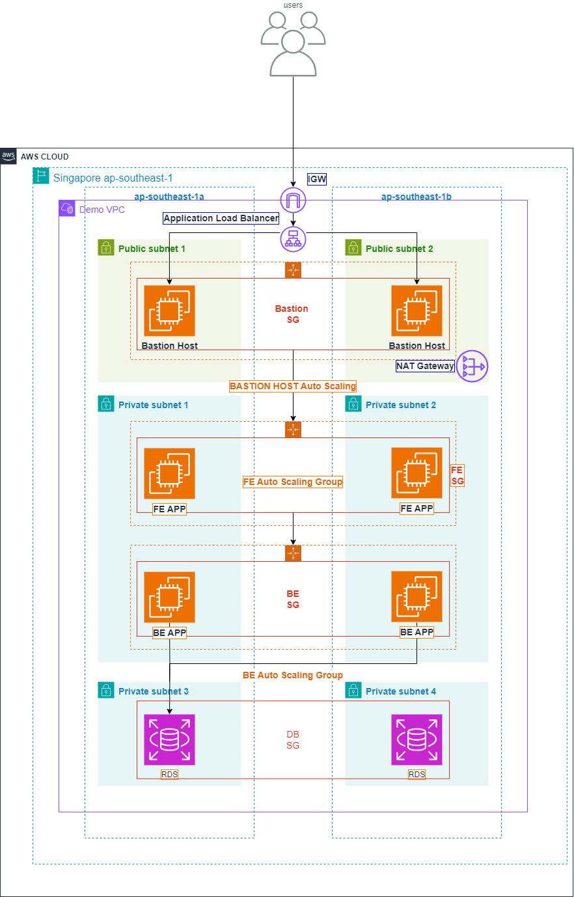
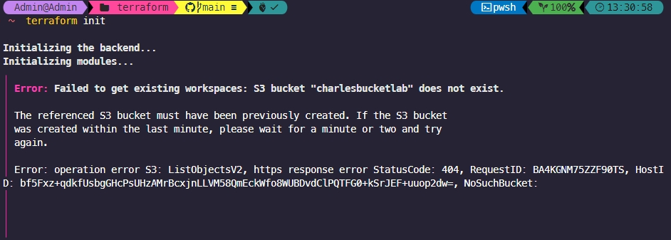
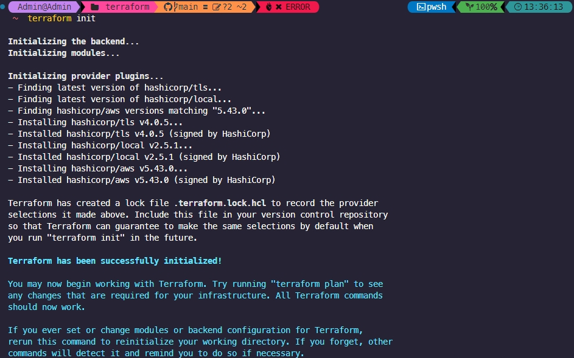

# Overview

+ I bulid infrastructure using Terraform based on this architecture below



Run the following command on the Visual Studio Code Terminal

```
terraform init
```




if you encountered this issue, it would be the error that you haven't created your S3 bucket

After you completed your S3 bucket, the issue will be gone
